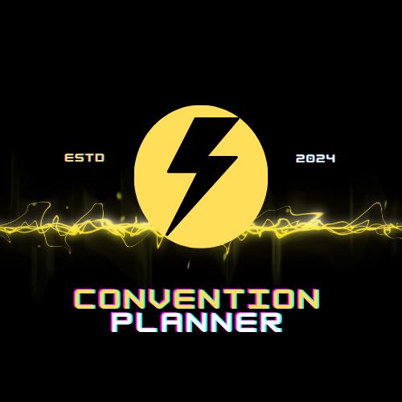

<a name="readme-top"></a>
<!-- PROJECT SHIELDS -->

[![Contributors][contributors-shield]][contributors-url] [![Forks][forks-shield]][forks-url]
[![Issues][issues-shield]][issues-url]
[![MIT License][license-shield]][license-url]


<!-- PROJECT LOGO -->
<br />
<div align="center">
  <a href="https://github.com/kathylopez97/Convention-Planner">
    
  </a>

  <h3 align="center">Convention Planner</h3>

  <p align="center">
    Create your own Convention here!
    <br />
    <!-- Need to change heroku from develop to main-->
    <a href="https://convention-planner-f58cd02bb10c.herokuapp.com/"><strong>Click here to get started»</strong></a>
    <br />
    <br />
    <a href="https://convention-planner-f58cd02bb10c.herokuapp.com/">View Demo</a>
    ·
    <a href="https://github.com/kathylopez97/Convention-Planner/issues">Report Bug</a>
    ·
    <a href="https://github.com/kathylopez97/Convention-Planner/issues">Request Feature</a>
  </p>
</div>


<!-- TABLE OF CONTENTS -->
<details>
  <summary>Table of Contents</summary>
  <ol>
    <li>
      <a href="#about-the-project">About Convention Planner</a>
      <ul>
        <li><a href="#built-with">Built With</a></li>
      </ul>
    </li>
    <li>
      <a href="#getting-started">Getting Started</a>
      <ul>
        <li><a href="#prerequisites">Prerequisites</a></li>
        <li><a href="#installation">Installation</a></li>
      </ul>
    </li>
    <li><a href="#usage">Usage</a></li>
    <li><a href="#roadmap">Roadmap</a></li>
    <li><a href="#contributing">Contributing</a></li>
    <li><a href="#license">License</a></li>
    <li><a href="#contact">Contact</a></li>
    <li><a href="#acknowledgments">Acknowledgments</a></li>
  </ol>
</details>


<!-- ABOUT THE PROJECT -->
## About Convention Planner
<!-- Will add screenshot of final project once its polished-->
[![Product Name Screen Shot][product-screenshot]]()

<!-- Convention Planner Description Information-->
Convention Planner is web-application that help users create their favorite events 

<p align="right">(<a href="#readme-top">back to top</a>)</p>


### Built With

Framework Used 

* [![Bulma][Bulma.io]][bulma-url]

* 
 * 

 * 

 * 

* 
<p align="right">(<a href="#readme-top">back to top</a>)</p>


<!-- GETTING STARTED -->
## Getting Started
### Prerequisites

How to get started with Convention Planner!
* npm
  ```sh
  npm install i
  ```

### Installation

Instructions on how to download our app.

1. Get a free API Key at [https://conventionplanner.com](https://convention-planner-f58cd02bb10c.herokuapp.com/)
2. Clone the repo
   ```sh
   git clone https://github.com/kathylopez97/Convention-Planner
   ```
3. Install NPM packages
   ```sh
   npm install
   ```
4. Enter your API in `config.js`
   ```js
   const API_KEY = '000000';
   ```

<p align="right">(<a href="#readme-top">back to top</a>)</p>


<!-- USAGE EXAMPLES -->
## Usage

<!-- WIll add screenshots of Project once deployed to main >

<p align="right">(<a href="#readme-top">back to top</a>)</p>


<!-- ROADMAP -->
## Roadmap

See the [open issues](https://github.com/kathylopez97/Convention-Planner/issues) for a full list of proposed features (and known issues).

<p align="right">(<a href="#readme-top">back to top</a>)</p>


<!-- CONTRIBUTING -->
## Contributing

Here is how you can be apart of creating Convention Planner.
1. Fork the Project
2. Create your Feature Branch (`git checkout -b Convention`)
3. Commit your Changes (`git commit -m 'Add my commits to main'`)
4. Push to the Branch (`git push origin main`)
5. Open a Pull Request

<p align="right">(<a href="#readme-top">back to top</a>)</p>


<!-- LICENSE -->
## License

[](https://opensource.org/licenses/MIT)
<p align="right">(<a href="#readme-top">back to top</a>)</p>


<!-- Links to our Convention Planner -->
## Contact
Created by Fakes 
- Contact our team if you have any questions 
<!-- Project Group Contact Info-->
1. [Kathy Lopez](https://github.com/kathylopez97/Convention-Planner)
2. [Stephen Rossetti](https://github.com/stephenrossetti)
3. [Daniel Jutila](https://github.com/DanielJutila)
4. [Hunter Bell](https://github.com/HunterBell512)


<p align="right">(<a href="#readme-top">back to top</a>)</p>


<!-- ACKNOWLEDGMENTS -->
## Acknowledgments
Thanks to our resources on creating our app!
* [Heroku Installation](https://coding-boot-camp.github.io/full-stack/heroku/deploy-with-heroku-and-mysql)
* [Markdown Badges](https://github.com/Ileriayo/markdown-badges)


<p align="right">(<a href="#readme-top">back to top</a>)</p>


<!-- MARKDOWN LINKS & IMAGES -->
<!-- https://www.markdownguide.org/basic-syntax/#reference-style-links -->
[contributors-shield]: https://img.shields.io/github/contributors/othneildrew/Best-README-Template.svg?style=for-the-badge
[contributors-url]: https://github.com/kathylopez97/Convention-Planner/graphs/contributors
<!-- forks-->
[forks-shield]: https://img.shields.io/github/forks/othneildrew/Best-README-Template.svg?style=for-the-badge

[forks-url]:https://github.com/kathylopez97/Convention-Planner/forks
[stars-shield]: https://img.shields.io/github/stars/othneildrew/Best-README-Template.svg?style=for-the-badge
[stars-url]: https://github.com/othneildrew/Best-README-Template/stargazers
[issues-shield]: https://img.shields.io/github/issues/othneildrew/Best-README-Template.svg?style=for-the-badge
[issues-url]: https://github.com/kathylopez97/Convention-Planner/issues
[license-shield]: https://img.shields.io/github/license/othneildrew/Best-README-Template.svg?style=for-the-badge
[license-url]: https://github.com/othneildrew/Best-README-Template/blob/master/LICENSE.txt
<!--framewokr url -->
[Bulma.io]:https://img.shields.io/badge/bulma-00D0B1?style=for-the-badge&logo=bulma&logoColor=white
[bulma-url]:https://bulma.io/